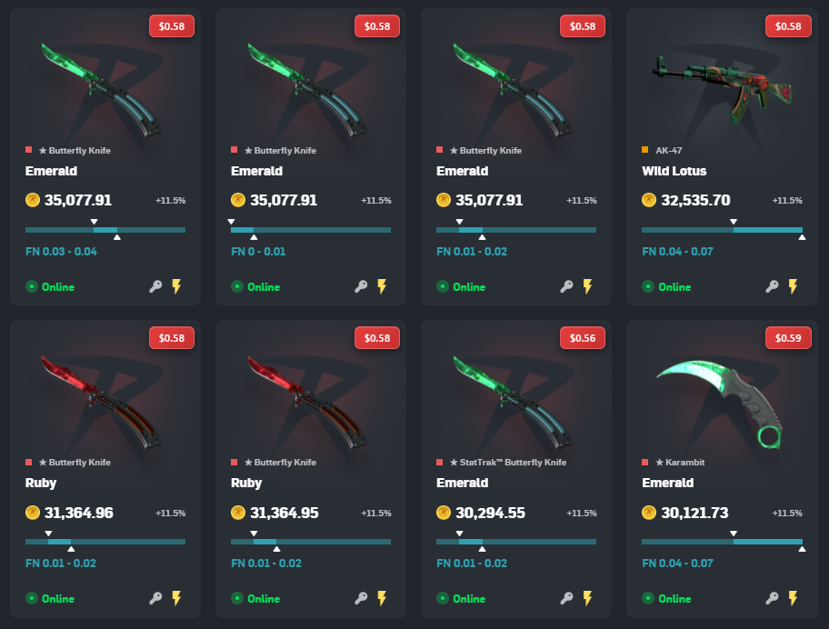
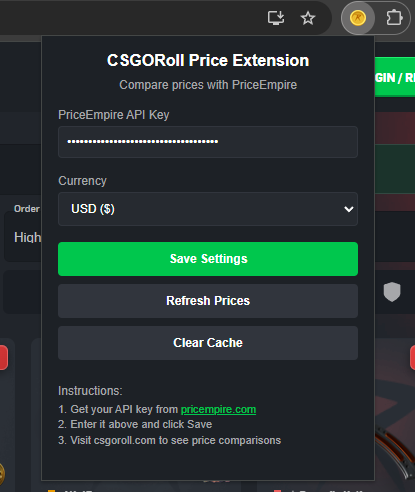

# CSGORoll Price Checker Extension

A Chrome extension that displays PriceEmpire price comparisons on CSGORoll items to help you make better trading decisions.

## Features

- Real-time price checking from PriceEmpire API
- Displays Buff163 prices directly on CSGORoll item cards
- Multiple currency support (USD, EUR, NOK, SEK, GBP, CAD, AUD)
- Caching system to minimize API calls
- Clean, user-friendly interface

## Installation

1. Download or clone this repository
2. Open Chrome and go to `chrome://extensions/`
3. Enable "Developer mode" in the top right
4. Click "Load unpacked" and select the extension folder
5. The extension will appear in your Chrome toolbar

## Setup

1. Get a PriceEmpire API key from [pricempire.com](https://pricempire.com)
2. Click the extension icon in Chrome
3. Enter your API key and select your preferred currency
4. Click "Save Settings"
5. Visit [csgoroll.com](https://csgoroll.com) to see price comparisons

## How It Works

The extension automatically detects CS2 items on CSGORoll and displays their current market prices from Buff163 via the PriceEmpire API. Prices are cached for 30 minutes to improve performance and reduce API usage.

*Example of price comparisons displayed on CSGORoll items*

## Extension Popup

*Extension popup interface for configuration*

## Files Structure

- `manifest.json` - Extension configuration
- `background.js` - Service worker for API calls and caching
- `content.js` - Content script that runs on CSGORoll pages
- `popup.html` - Extension popup interface
- `popup.js` - Popup functionality
- `styles.css` - Styling for price overlays
- `coin.png` - Extension icon

## Privacy

This extension only accesses CSGORoll pages and the PriceEmpire API. No personal data is collected or transmitted beyond what's necessary for price checking functionality.

## Support

If you encounter any issues, please check that:
1. Your PriceEmpire API key is valid and has sufficient credits
2. You're on a supported CSGORoll page
3. The extension has permission to access CSGORoll

## License

This project is open source and available under the MIT License.